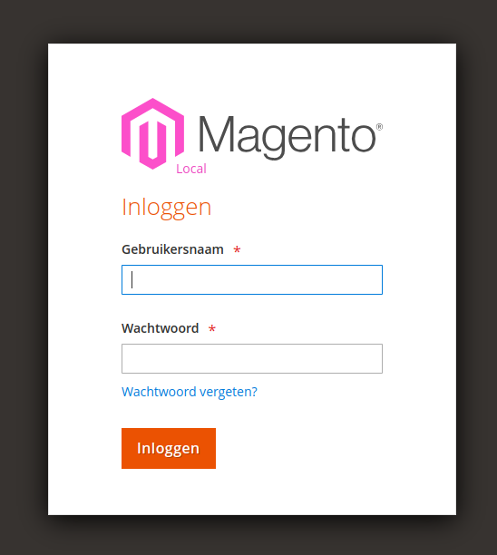
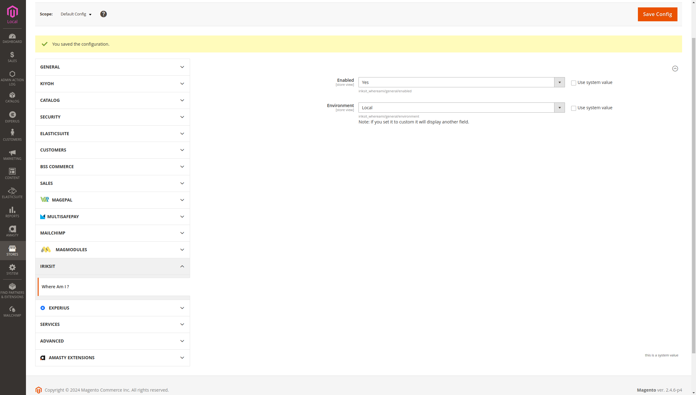

# Mage2 Module - Where Am I

`iriks-it/module-whereami`

- [Main Functionalities](#markdown-header-main-functionalities)
- [Installation](#markdown-header-installation)
- [Configuration](#markdown-header-configuration)

## Main Functionalities

Ever doubted yourself where you were? or, maybe... changed a setting on a live server while you thought you were on the
staging?
That would be a bloody nightmare! Fear no more!
This handy little module will always show you where you are!

## Installation

\* = in production please use the `--keep-generated` option

### Type 1: Zip file

- Unzip the zip file in `app/code/IriksIT`
- Enable the module by running `php bin/magento module:enable IriksIT_WhereAmI`
- Apply database updates by running `php bin/magento setup:upgrade`\*
- Flush the cache by running `php bin/magento cache:flush`

### Type 2: Composer

- Install the module composer by running `composer require iriks-it/module-whereami`
- enable the module by running `php bin/magento module:enable IriksIT_WhereAmI`
- apply database updates by running `php bin/magento setup:upgrade`\*
- Flush the cache by running `php bin/magento cache:flush`

## Configuration
- You can easily turn the module off in the storemanager
- You can easily mark an installation by type
- Type not listed ? No worries! you can set a custom title

